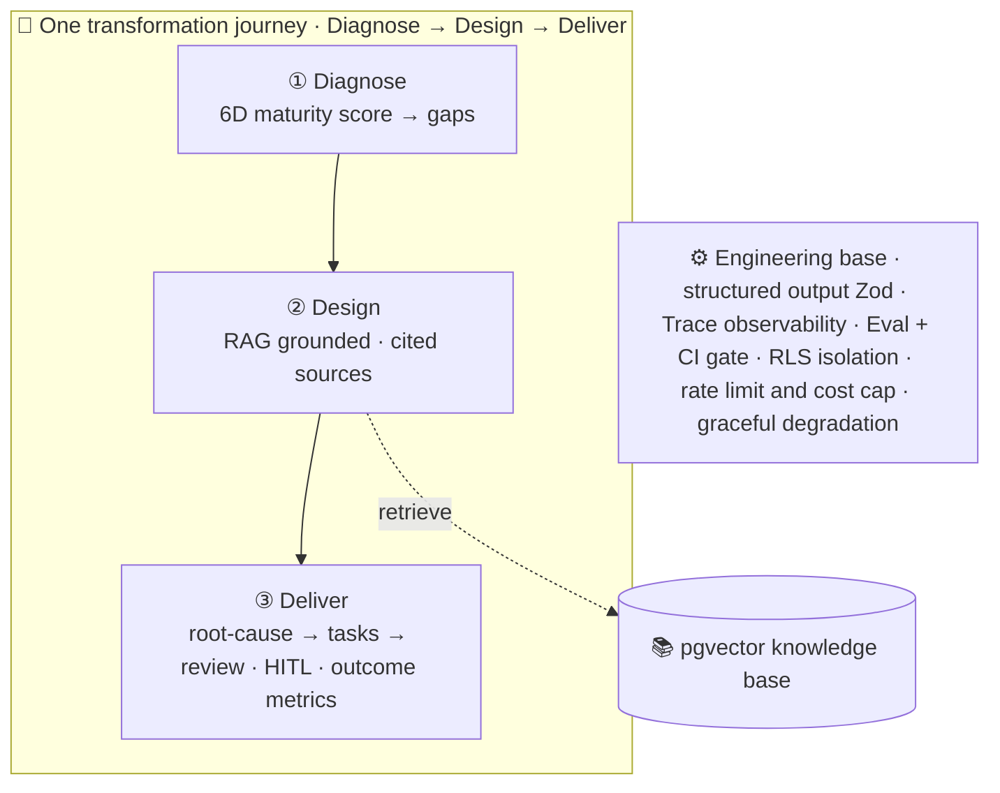

# AI Transformation Workbench · 企业 AI 数智化转型工作台

[中文](README.md) ｜ **English**

> An end-to-end AI deployment system that turns a company's vague "we want to use AI" into something **trustworthy, observable, and demonstrable**: a diagnosis, a grounded solution, and a working business loop.

🔗 **Live demo**: <https://aiworkbench.wowonderwhy.com>

The public site now supports **limited live LLM + RAG runs**: each anonymous visitor gets 15 credits per day, with a site-wide daily LLM + Embedding cost cap of $1. When credits or budget are exhausted, the app gracefully falls back to deterministic rule-based outputs. `/traces` shows live calls, tokens, cost, and latency.

Built around a **Diagnose → Design → Deliver** spine that connects three modules, with a **manufacturing quality-incident closed loop** as the fully worked example. The scenarios come from real pain points of manufacturing clients (automotive electronics / semiconductor).



---

## See it in one minute (live runs + real snapshots)

Public forms can call LLM + RAG live within the quota. The public "**View real AI examples**" entries also keep frozen artifacts produced by real LLM + RAG runs (zero cost, deterministic display):

| Module | Direct link |
|---|---|
| Diagnosis report (structured AI insight) | [/diagnosis/report?id=28c7c17e…](https://aiworkbench.wowonderwhy.com/diagnosis/report?id=28c7c17e-7549-49e8-960c-16c3eeb0b84b) |
| Industry solution (grounded + cited sources) | [/solution-builder/result?id=ddbec716…](https://aiworkbench.wowonderwhy.com/solution-builder/result?id=ddbec716-99d6-4e9a-84c1-069546310989) |
| Manufacturing loop (root-cause → tasks → review + HITL) | [/manufacturing-demo/analysis?id=c7a1e47d…](https://aiworkbench.wowonderwhy.com/manufacturing-demo/analysis?id=c7a1e47d-9b8f-4c18-b8f4-6a684132da4c) |
| Trace Viewer (cost / latency / call tracing) | [/traces](https://aiworkbench.wowonderwhy.com/traces) |

## Core capabilities

- **Structured diagnosis**: a 6-dimension maturity questionnaire → structured LLM insight (Zod-validated).
- **Grounded solutions**: RAG over a knowledge base → recommendations / root-causes that **must cite their sources**; honest abstention when there's no basis.
- **Business closed loop**: manufacturing quality incident — report → root cause → tasks → human-in-the-loop board → review, driven by a state machine with event auditing.
- **One transformation journey**: the diagnosis result feeds the solution, the solution lands in the operational loop, and the loop reports **outcome metrics derived from real data** (task closure rate / AI-automation share / auditable steps).
- **Observability**: every LLM/embedding call is written to `llm_traces`; `/traces` shows cost / latency (p50·p95) / structured output / RAG citations / errors.
- **Evaluation + CI**: `npm run eval` runs a golden set (schema / citations / **faithfulness via LLM-as-judge** / recall); a **record/replay cassette** lets the eval run as a **keyless CI gate** (`tsc + unit tests + eval replay + build`).
- **Engineering base**: data isolation (anonymous sign-in + Postgres RLS), abuse/cost guards (public-AI switch + anonymous daily credits + daily cost cap + rate limit), provider abstraction (no vendor lock-in), graceful degradation, server-only secrets, limited public live runs + real-output snapshots.

## Key results

| Metric | Value |
|---|---|
| Citation faithfulness (eval-driven) | **0/3 → 3/3** |
| Retrieval recall@k | 2/2 (top-ranked case hit, cos 0.82) |
| Cost / latency per call | ≈ $0.005 / p50 ≈ 7s |
| Eval scorecard | schema 100% · valid citations 100% · faithfulness 3/3 · recall 2/2 |

## Tech stack

Next.js 14 (App Router) · React 18 · TypeScript · Tailwind · Supabase (Postgres + **pgvector**) · OpenAI-compatible LLM (DeepSeek by default, switchable to Qwen/OpenAI) · DashScope `text-embedding-v4` · Zod · Vercel.

## How it works (the journey)

```
①  Diagnose            ②  Design              ③  Deliver
assess where you are ─▶ generate the plan ──▶ run it & measure outcomes
(maturity score)       (grounded, cited)      (HITL loop + outcome metrics)
```

The three modules are not isolated tools — each step's output is the next step's input. A journey navigator stitches them into one coherent path: **see your baseline → get a grounded plan → run a measurable closed loop.**

## Documentation

| Doc | Contents |
|---|---|
| [docs/ARCHITECTURE.md](docs/ARCHITECTURE.md) | Architecture overview + data-flow diagram (Mermaid) |
| [docs/ADR.md](docs/ADR.md) | Architecture Decision Records (why + trade-offs + known boundaries) |

## Run locally

```bash
npm install
cp .env.example .env.local     # fill Supabase & LLM/Embedding keys (see comments in .env.example)
# In the Supabase SQL Editor run supabase/migrations/*.sql in order (0001 → 0002 → 0003)
# and enable "Anonymous sign-ins" in the Supabase dashboard (for RLS data isolation)
npm run ingest                 # ingest the knowledge base (chunk → embedding → pgvector)
npm run dev                    # http://localhost:3000
npm run eval                   # online eval (requires the dev server + keys)
npm test                       # pure-function unit tests (no keys)
npm run eval:ci                # recorded-eval replay (no keys, offline)
```

> Public live runs are controlled by `PUBLIC_AI_ENABLED`. The current production site has it enabled, with 15 credits per anonymous identity per day and a $1 daily site-wide LLM + Embedding cost cap. Set it to `false` and redeploy to return to rule-based fallback + real snapshot mode.

## Status & boundaries (honest)

**Demo / preview build.** Known trade-offs and roadmap are in [ADR-0008](docs/ADR.md#adr-0008--已知缺口与路线图诚实边界): the public site now supports quota-limited live runs, while `PUBLIC_AI_ENABLED=false` can switch it back to real snapshots + rule-based fallback; traces are still a flat table. The engineering base is in place: data isolation (anonymous sign-in + Postgres RLS fixing IDOR, [ADR-0010](docs/ADR.md#adr-0010--匿名登录--rls-数据隔离修复-idor)), abuse/cost guards (public-AI switch + anonymous daily credits + daily LLM/Embedding cost cap + rate limit, with graceful degradation, [ADR-0013](docs/ADR.md#adr-0013--滥用与成本防护限流--当日成本上限)), and a keyless CI gate (tsc + unit tests + **recorded-eval replay**, [ADR-0012](docs/ADR.md#adr-0012--接入-ci自动门禁) / [ADR-0014](docs/ADR.md#adr-0014--录制式-eval-进-ci离线无密钥的评测门禁)). Still to come: real accounts (anonymous identity is browser-bound), org-level multi-tenancy, API integration tests, span-tree traces.

## Author

By **Connie Wang** — AI FDE / AI Application Delivery / Customer Success. Designed and built from scratch with [Claude Code](https://claude.com/claude-code).
